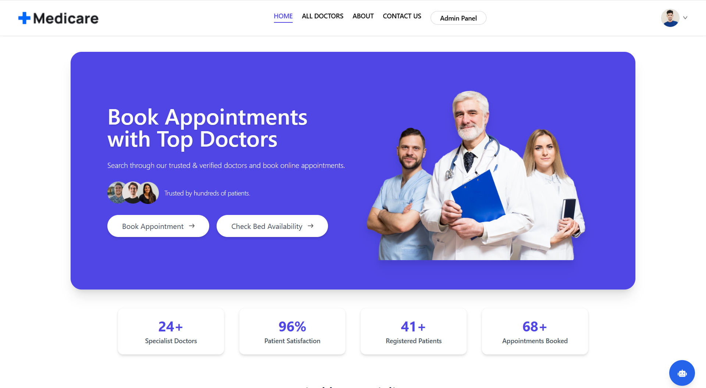
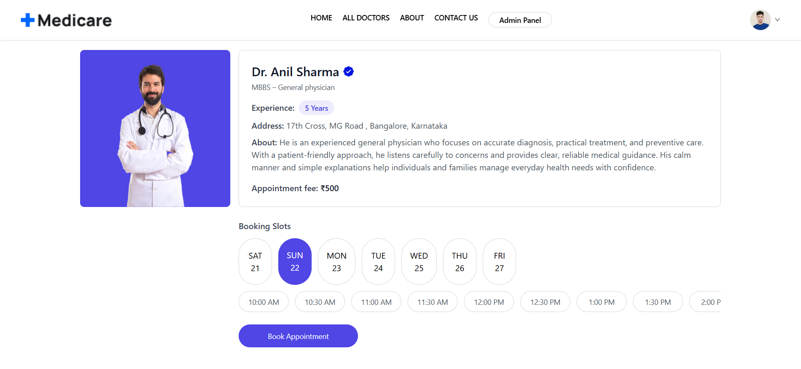
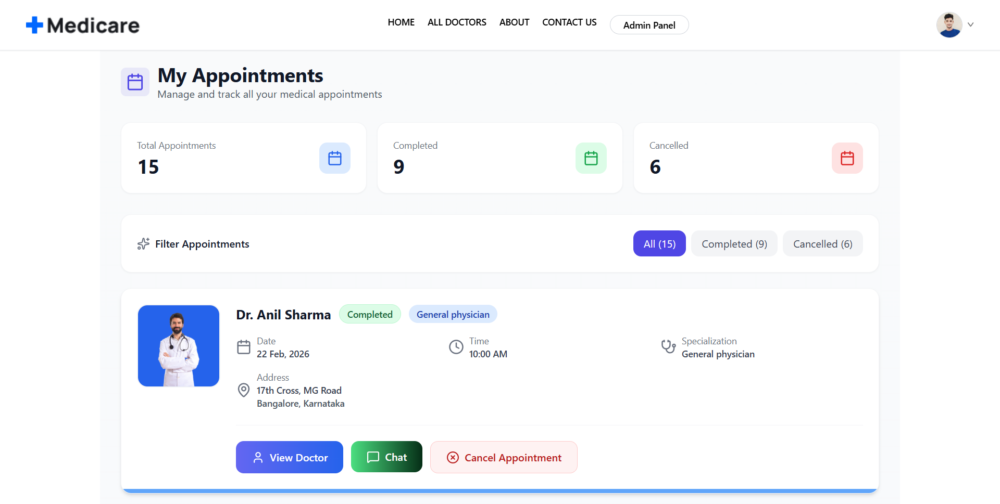
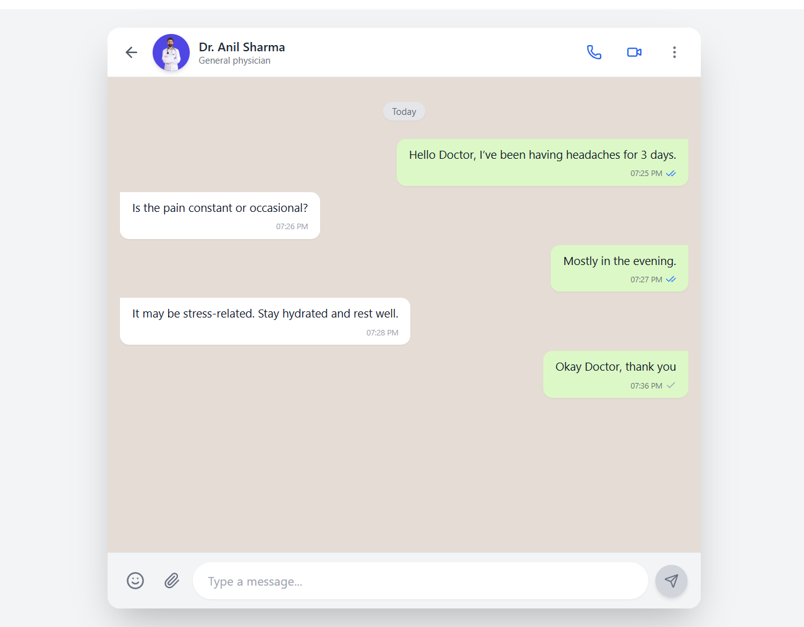
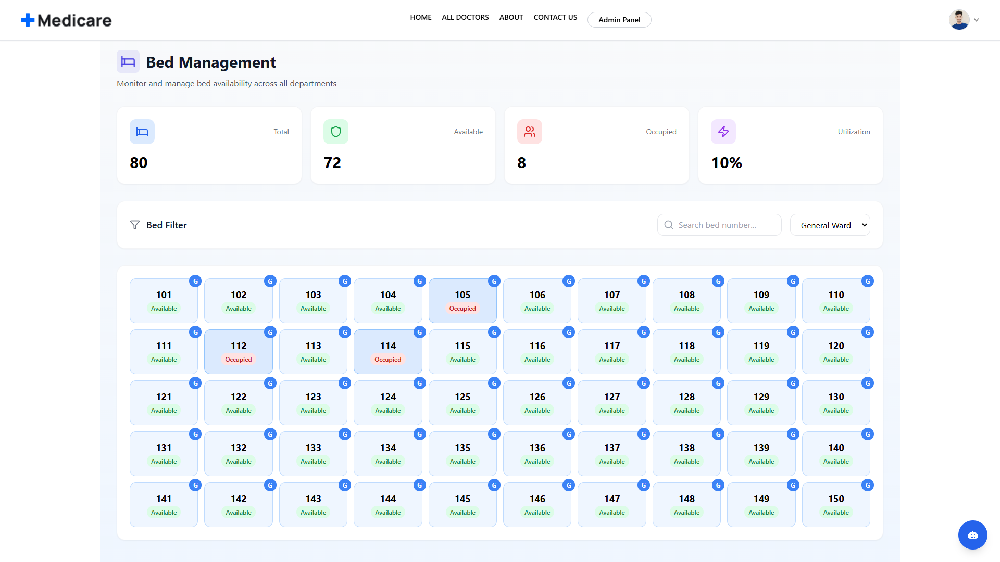
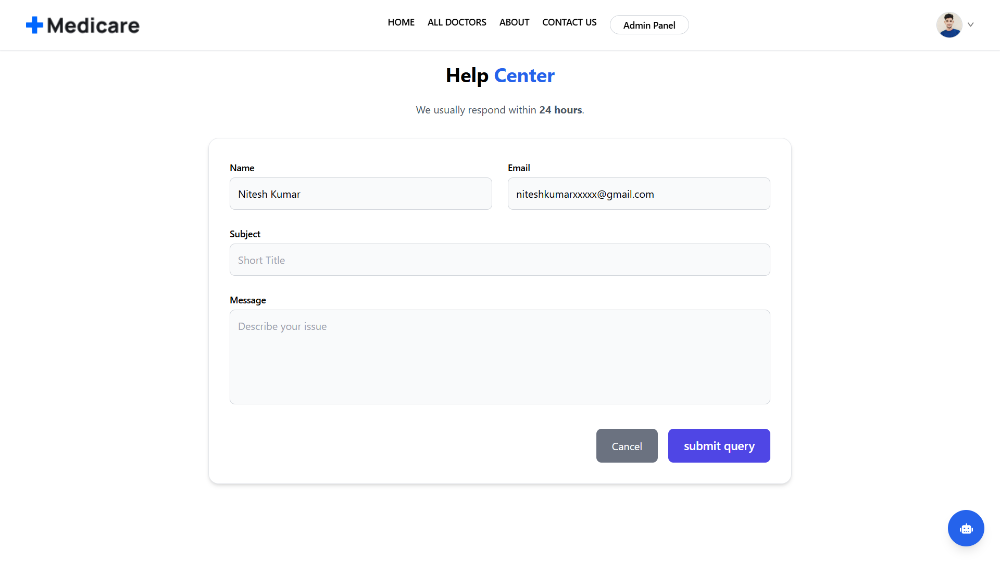
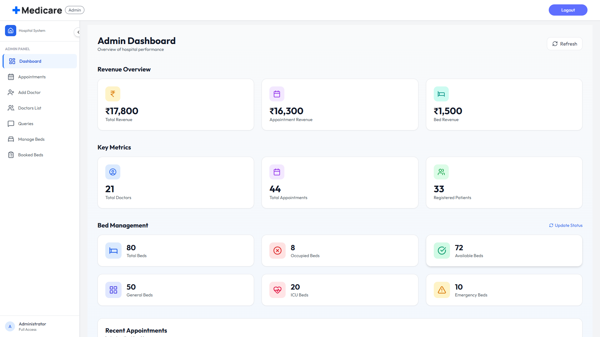
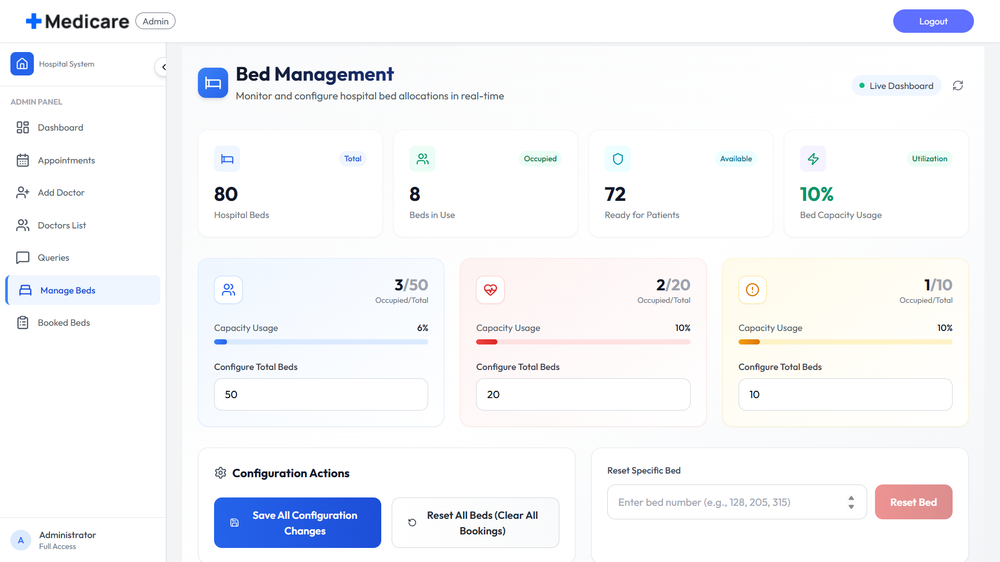

# 🏥 Medicare – Full Stack Healthcare Management Platform &nbsp; | &nbsp; 🌐 [Live Demo](https://medicare-pr8s.onrender.com)

<!-- BADGES -->
<p align="center">
  
  
  
  
  
</p>

---

## 🔒 Source Code Notice

> ⚠️ The full production source code is intentionally kept private to prevent unauthorized duplication or misuse.

The working application, including all implemented features, is available via the live deployment link below.

🔗 **Live Demo:** https://medicare-pr8s.onrender.com/

---
## 📸 Screenshots

### 🏠 Home Page
<p align="center">
  
</p>
<p align="center"><i>Hero section with doctor booking, bed availability, and service highlights.</i></p>


### 👨‍⚕️ Doctor Listing Page

<p align="center">
  
</p>

<p align="center">
  <i>Browse verified doctors with availability status, specialization details, and quick booking access.</i>
</p>

### 📅 Doctor Profile & Appointment Booking

<p align="center">
  
</p>

<p align="center">
<i>Doctor profile with availability, experience, and slot-based appointment booking.</i>
</p>


### 📋 My Appointments Dashboard

<p align="center">
  
</p>

<p align="center">
<i>Dashboard to manage appointments with status tracking, filtering, and doctor chat option.</i>
</p>

### 💬 Real-Time Doctor Chat

<p align="center">
  
</p>

<p align="center">
  <i>Secure real-time messaging interface enabling direct communication between patients and doctors.</i>
</p>

### 🛏️ Bed Management System

<p align="center">
  
</p>

<p align="center">
  <i>Real-time bed availability tracking with department filters, occupancy status, and utilization analytics.</i>
</p>

### 🛟 Help Center & Support

<p align="center">
  
</p>

<p align="center">
<i>Help center form for submitting support queries and assistance requests.</i>
</p>

### 🩺 Doctor Dashboard Panel

<p align="center">
  
</p>

<p align="center">
  <i>Doctor dashboard displaying earnings, total appointments, patient count, and latest booking activity.</i>
</p>

### 🛠️ Admin Dashboard

<p align="center">
  
</p>

<p align="center">
  <i>Comprehensive admin panel displaying revenue analytics, key metrics, doctor and patient statistics, and real-time bed management overview.</i>
</p>

### 🛏️ Admin Bed Configuration Panel

<p align="center">
  
</p>

<p align="center">
 <i>Admin panel for configuring bed capacity and managing hospital bed utilization in real-time.</i>
</p>


---

## ✨ Features

### 😷 Patient Features
- **Secure Authentication:** JWT-based login, OTP-based signup verification, and password reset via email.
- **Appointments:** Search doctors by specialization and book real-time appointments.
- **Hospital Services:** Bed booking system with real-time availability tracking.
- **Payments:** Secure online payments integration using Razorpay with booking confirmation.
- **Profile Management:** Update personal details with real-time username availability check.
- **History:** View appointment and bed booking history with status tracking.
- **Feedback System:** Submit reviews and ratings for doctors.
- **Support System:** Submit queries and track support requests.
- **Chatbot:** Integrated chatbot for instant user assistance and common queries.
- **Chat with Doctor:** Real-time post-appointment messaging system for patient-doctor communication.


### 👨‍⚕️ Doctor Features
- **Secure Authentication:** Protected doctor login with role-based access control.
- **Dashboard:** Personalized dashboard displaying assigned appointments and patient details.
- **Appointment Management:** View, accept, update, and manage appointment status (Completed / Cancelled).
- **Availability Management:** Set and update appointment availability slots.
- **Profile Management:** Manage professional details, specialization, and experience information.
- **Communication:** Respond to patient messages after appointment completion.

###  🛡️ Admin  Features
- **Control:** Admin authentication with role-based access.
- **Doctor Management:** Add, edit, and view doctor details.
- **Operations:** Manage appointments, beds, and bed bookings.
- **Support:** Manage and resolve support queries.
- **Analytics:** Comprehensive admin analytics dashboard.

---

## 🧑‍💻 Tech Stack

### Frontend
- **Framework:** React.js (Vite)
- **Styling:** Tailwind CSS, PostCSS
- **Routing:** React Router DOM
- **HTTP Client:** Axios
- **Animations:** Framer Motion
- **Notifications:** React Toastify

### Backend
- **Runtime:** Node.js
- **Framework:** Express.js
- **Database:** MongoDB with Mongoose
- **Auth:** JWT Authentication
- **Uploads:** Multer (with Cloudinary)
- **Email:** Nodemailer (Brevo/SMTP)
- **Payments:** Razorpay

### DevOps & Tools
- **Deployment:** Render
- **Version Control:** Git & GitHub

### ⚙️ System

* Protected routes & middleware security
* Context API state management
* Custom hooks
* Clean REST API architecture

---

##  📁 Folder Structure
```
Medicare/
│
├── Backend/
│   ├── config/
│   ├── controllers/
│   │   ├── admin/
│   │   ├── doctor/
│   │   ├── user/
│   │   ├── bed/
│   │   ├── payment/
│   │   ├── message.controller.js
│   │   ├── reviewController.js
│   │   └── supportController.js
│   │
│   ├── services/
│   │   ├── admin/
│   │   ├── doctor/
│   │   ├── user/
│   │   ├── bed/
│   │   ├── payment/
│   │   └── message.service.js
│   │
│   ├── models/
│   ├── routes/
│   ├── middlewares/
│   ├── mail/
│   ├── socket/
│   ├── utils/
│   │
│   ├── seedBed.js
│   ├── server.js
│   ├── package.json
│   └── .env
│
├── frontend/   (Patient Panel)
│   ├── public/
│   ├── src/
│   │   ├── auth/
│   │   ├── chat/
│   │   ├── chatbot/
│   │   ├── components/
│   │   ├── context/
│   │   ├── hooks/
│   │   ├── layouts/
│   │   ├── pages/
│   │   ├── payments/
│   │   ├── routes/
│   │   ├── data/
│   │   ├── socket.js
│   │   ├── App.jsx
│   │   └── main.jsx
│   │
│   ├── .env
│   ├── index.html
│   ├── package.json
│   ├── vite.config.js
│   └── tailwind.config.js
│
├── admin/   (Admin Panel)
│   ├── public/
│   ├── src/
│   │   ├── assets/
│   │   ├── chat/
│   │   ├── components/
│   │   ├── context/
│   │   ├── layout/
│   │   ├── pages/
│   │   ├── socket.js
│   │   ├── App.jsx
│   │   └── main.jsx
│   │
│   ├── .env
│   ├── index.html
│   ├── package.json
│   ├── vite.config.js
│   └── tailwind.config.js
│
├── README.md
└── .gitignore
```

---


## 🔐 Environment Variables

### 1. Frontend 

```env
VITE_BACKEND_URL=your_backend_url
VITE_GOOGLE_CLIENT_ID=your_google_client_id
VITE_RAZORPAY_KEY_ID=your_razorpay_key
``` 
### 2. Admin 

```env
VITE_BACKEND_URL=your_backend_url
```

### 3. Backend 

```env
PORT=4000
NODE_ENV=production
MONGODB_URL=your_mongodb_url
JWT_SECRET=your_jwt_secret
JWT_EXPIRES_IN=7d
FRONTEND_URL=your_frontend_url
ADMIN_URL=your_admin_url
CLIENT_URL=your_frontend_url
ADMIN_EMAIL=admin_email
ADMIN_PASSWORD=admin_password
GOOGLE_CLIENT_ID=your_google_client_id
CLOUDINARY_NAME=cloudinary_name
CLOUDINARY_API_KEY=cloudinary_key
CLOUDINARY_SECRET_KEY=cloudinary_secret
BREVO_API_KEY=email_api_key
RAZORPAY_KEY_ID=razorpay_key
RAZORPAY_KEY_SECRET=razorpay_secret
CURRENCY=INR
```
---


## 🔮 Future Features
- Doctor availability calendar
- Appointment reminders (Email / SMS)
- Prescription upload (PDF)
- Dark mode support

---

## 👨‍💻 Author

**Nitesh Kumar**

🔗 GitHub: https://github.com/nitesh-kumar864  

📧 Email: nitesh.kumar70023@gmail.com

